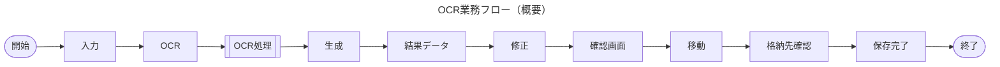
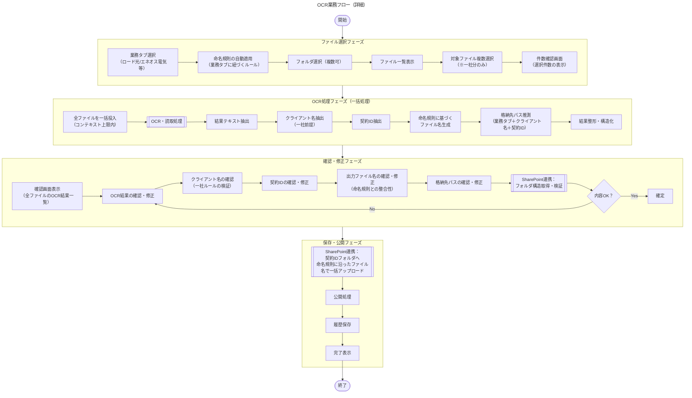
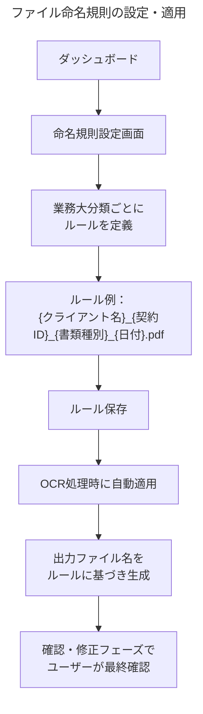
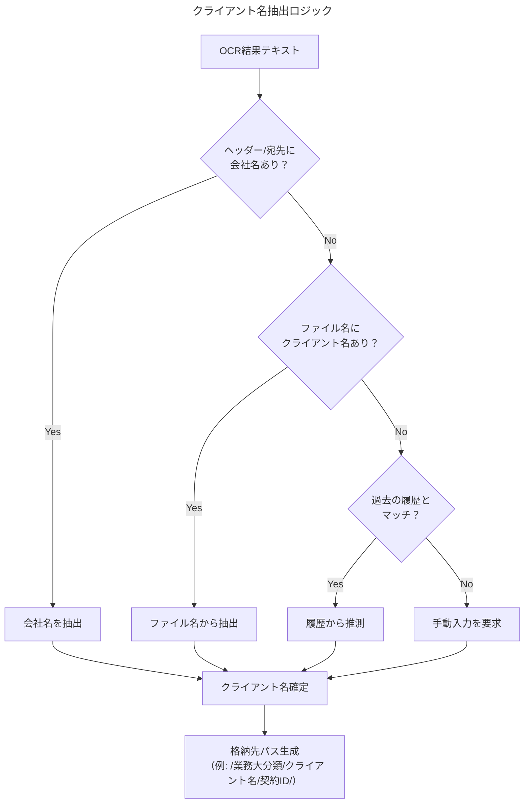

# OCR業務フロー

## 前提条件・業務ルール

### 業務タブによる大分類

- 最初の「業務タブ選択」で、業務の大分類（ロード光、エネオス電気 等）が決定される
- この大分類により、OCR対象の帳票種別や格納先の上位パスが確定する

### ファイル命名規則

- 業務大分類（ロード光、エネオス電気 等）ごとに **ファイルの命名規則が個別に定義されている**
- 命名規則は **ダッシュボード上で設定・管理する**（ルールを作成し適用する運用）
- OCR処理の出力は、適用された命名規則に沿ったファイル名で生成される
- 最終的にSharePointへは **命名規則に従った正しいファイル名** で格納される

### 複数ファイル入力のルール

- 一度の操作で入力される複数ファイルは **必ず一社（一クライアント）に限る** というルールが前提
- このルールにより、選択された複数ファイルはすべて同一クライアントの書類として扱う
- クライアントが正しいかどうかの確認は確認・修正フェーズで行う

### OCR処理の方針

- OCR処理はファイルごとのループではなく、**コンテキスト上限に収まる限りまとめて一括投入する**
- 一社ルールの前提があるため、まとめて処理しても結果の整合性に問題はない

### 格納先のフォルダ構造

- 格納先は以下のような階層構造を想定：
  ```
  [業務大分類（タブで選択済み）]
    └── [クライアント名]
          └── [契約ID]
                ├── 命名規則に沿ったファイル名1.pdf
                ├── 命名規則に沿ったファイル名2.pdf
                └── 命名規則に沿ったファイル名3.pdf
  ```
- アップロードされる複数ファイルは、**一つの格納先（クライアント）配下の契約IDフォルダにまとまって格納される**
- 格納先パスはOCR結果から推測し、確認・修正フェーズでユーザーが確認する
- 最終成果物：**適切なフォルダ** に **適切な名前** で格納されたファイル群

---

## 概要フロー



## 詳細フロー



## 命名規則の管理フロー



## クライアント名決定ルール



## 格納先推測ロジック

```mermaid
---
title: 格納先パス推測
---
flowchart TD
    A["入力情報\n（業務タブ＋クライアント名＋契約ID）"] --> B[[SharePointフォルダ構造を検索]]
    B --> C{既存の契約ID\nフォルダあり？}
    C -- Yes --> D[既存パスを提案]
    C -- No --> E["新規フォルダ作成を提案\n（/業務大分類/クライアント名/契約ID/）"]
    D --> F["格納先パス確定\n（確認・修正フェーズで検証）"]
    E --> F
保科文人 フロー図としてはこういうものを期待しています！
命名規則の部分についてはちょっと前の会議から時間空いて少し曖昧になってしまったんだけど、実際はダッシュボードで設定した形で各画像の命名が決まるイメージです！

業務大分類ごとに「ファイルの特徴（ヘッダー等） → ファイル種別 → ファイル名」の対応ルールをダッシュボードで事前設定する。業務タブ選択でルールセットが確定するため、別業務の命名規則が混入しない。実際の種別判定はAIがOCR結果をもとに行い、該当する命名規則を自動適用する。なのでAIが判断する認識が正しい

---

## 2026-04-15 SharePoint 実構造確認メモ

### 確認済みの接続先

- Site URL: `https://load1993.sharepoint.com/sites/AIOCR`
- Site ID: `load1993.sharepoint.com,d7e8ba42-5835-414b-9b5b-23725b899de2,c478600c-1d19-4f5d-a0c1-febc3d717b07`
- Drive: `ドキュメント`
- Drive ID: `b!Qrro1zVYS0GbWyNyW4md4gxgeMQZHV1PoMH-vD1xewfCXzFXjUYOSoiociojrVTm`
- SharePoint ルート配下で ROAD が使う対象ベースは `General/AIOCR`

### ROAD UI タブとの紐付け

- モバイル -> `General/AIOCR/モバイル`
- 電力 -> `General/AIOCR/電力`
- リース・現金 -> `General/AIOCR/リース・現金`
- コラボ -> `General/AIOCR/コラボ`
- 酒井（領収書） -> `General/AIOCR/酒井（領収証）`

備考:

- UI のタブ名は `酒井（領収書）`
- SharePoint 実フォルダ名は `酒井（領収証）`
- この差は `sharepointFolderPath` で吸収する

### 実際の階層構造

```text
General/
	AIOCR/
		モバイル/
		電力/
		リース・現金/
		コラボ/
		酒井（領収証）/
```

### モバイル直下

- `申込日_社名_ヘッダー` (children=1)
- `申込日_社名_情報変更` (children=1)
- `申込日_社名_申込書` (children=1)
- `申込日_社名_相対` (children=1)
- `申込日_社名_担当者情報` (children=1)
- `申込日_社名_注意事項` (children=1)
- `申込日_社名_帳票` (children=1)
- `申込日_社名_謄本` (children=1)

### 電力直下

- `申込日_社名_チェックシート` (children=1)
- `申込日_社名_ポイント計算` (children=1)
- `申込日_社名_申込書（高圧）` (children=1)
- `申込日_社名_申込書（低圧）` (children=1)
- `申込日_社名_明細` (children=1)

### リース・現金直下

- `申込日_社名_おまかせ設定サポート` (children=1)
- `申込日_社名_カゴヤ解約確認書` (children=1)
- `申込日_社名_キヤノンケアギャランティ契約書` (children=1)
- `申込日_社名_キヤノン保守契約書` (children=1)
- `申込日_社名_ホスティング申込書` (children=1)
- `申込日_社名_リース契約書` (children=6)
- `申込日_社名_リース終了通知書` (children=1)
- `申込日_社名_工事依頼書` (children=1)
- `申込日_社名_残リース` (children=1)
- `申込日_社名_仕入れ` (children=23)
- `申込日_社名_請求予定表` (children=1)
- `申込日_社名_注文請書` (children=3)
- `申込日_社名_特約事項に関する確認書` (children=1)
- `申込日_社名_盤面シート` (children=1)
- `申込日_社名_物件受領書` (children=6)
- `申込日_社名_保守サービス申込書` (children=1)

### コラボ直下

- `申込日_社名_ISP解約依頼シート` (children=4)
- `申込日_社名_ISP発行依頼シート` (children=3)
- `申込日_社名_ギガらく申込書` (children=3)
- `申込日_社名_チェックシート` (children=3)
- `申込日_社名_プラン変更申込書` (children=4)
- `申込日_社名_フリーアクセス` (children=4)
- `申込日_社名_ロード光申込書` (children=12)
- `申込日_社名_移転申込書` (children=3)
- `申込日_社名_解約申込書` (children=5)
- `申込日_社名_開通案内` (children=2)
- `申込日_社名_口座振替依頼書` (children=5)
- `申込日_社名_合算請求` (children=4)
- `申込日_社名_事業者変更（解約）` (children=4)
- `申込日_社名_重要事項` (children=11)
- `申込日_社名_譲渡承認請求書` (children=4)
- `申込日_社名_転用手数料割引` (children=3)
- `申込日_社名_変更元事業者違約金についての覚書` (children=3)
- `申込日_社名_変更申請書` (children=4)
- `申込日_社名_明細` (children=3)

### 酒井（領収証）直下

- `12月例会案内_東京経営研究会_20251218` (children=1)
- `月末日_LINEヤフー株式会社_合計金額` (children=1)
- `航空券発券日_全日本空輸株式会社_金額` (children=13)
- `購入日_西日本旅客鉄道_金額` (children=2)
- `購入日_東海旅客鉄道_金額` (children=3)
- `購入日_東日本旅客鉄道株式会社_金額` (children=6)
- `注文日_Yahooショッピング名_合計金額` (children=3)
- `田舞塾26期第5講の案内_20260116` (children=3)
- `補助資料_田舞塾_202602` (children=2)
- `利用期間末日_ドコモ_合計請求額` (children=1)
- `利用月_ソフトバンク株式会社_請求金額` (children=1)
- `利用日_株式会社一休_金額` (children=3)
- `利用日_日本経済新聞社_金額` (children=2)
- `料金券発行日_日本航空株式会社_金額` (children=4)

### OCR 本番実装への示唆

- 実運用の SharePoint 構造は、当初想定していた `大分類/クライアント名/契約ID` ではなく、まず `大分類/書類種別ルール名` で整理されている
- つまり OCR の役割は `どの大分類か` だけではなく、`大分類の下のどの書類種別フォルダに入れるか` の判定まで含む
- 直下フォルダ名は実質的に命名規則テンプレートになっている
- 書類種別フォルダの `children` が 1 のものは、サンプルまたはテンプレート 1 点管理の可能性が高い
- `children` が複数のものは、単一書類種別でも複数バリエーションがあるため、OCR 結果だけでなく追加特徴量（会社名、日付、サービス名、金額、回線種別など）が必要になる
- ROAD 側ではまず `Tab -> base folder` を固定し、その次に `documentType -> target subfolder` を決めるロジックを追加するのが自然
- 命名規則 UI は現状 `documentType` と `pattern` を持てるので、次段階では `targetSubfolder` も持たせると SharePoint 既存運用と揃えやすい
- 先にやるべき最小実装は `General/AIOCR/<業務タブ>` 直下への保存確認、その後に `書類種別フォルダ` まで自動振り分けを実装する流れが安全