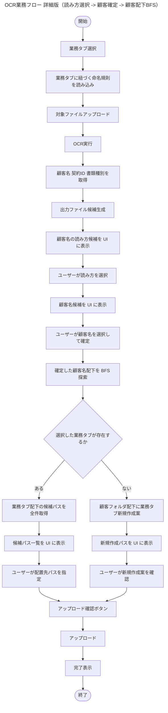
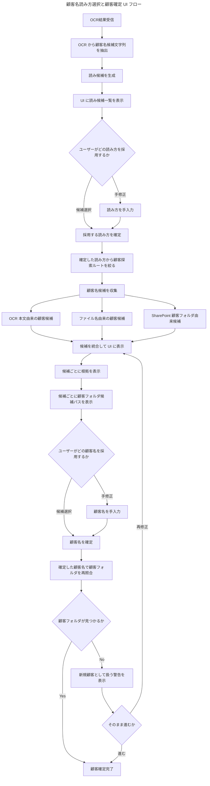
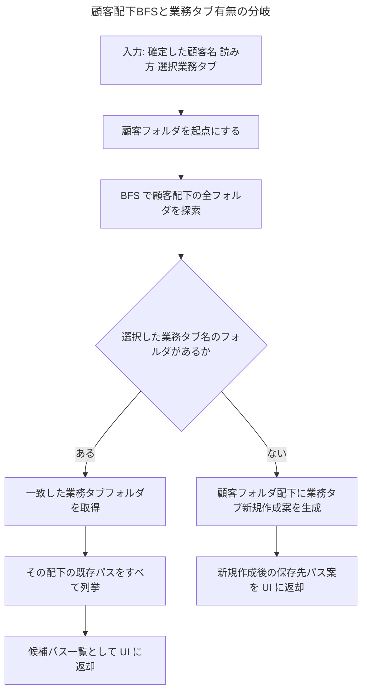
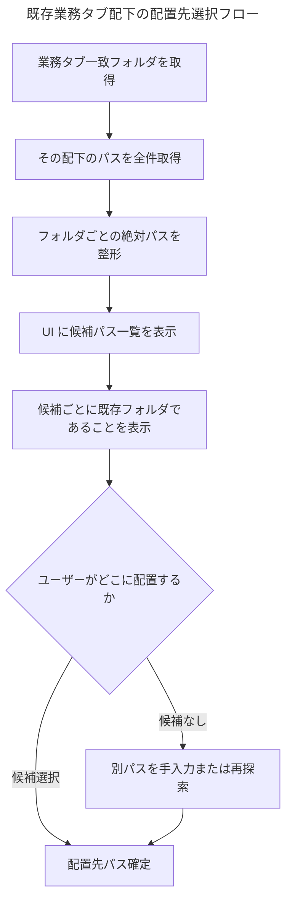
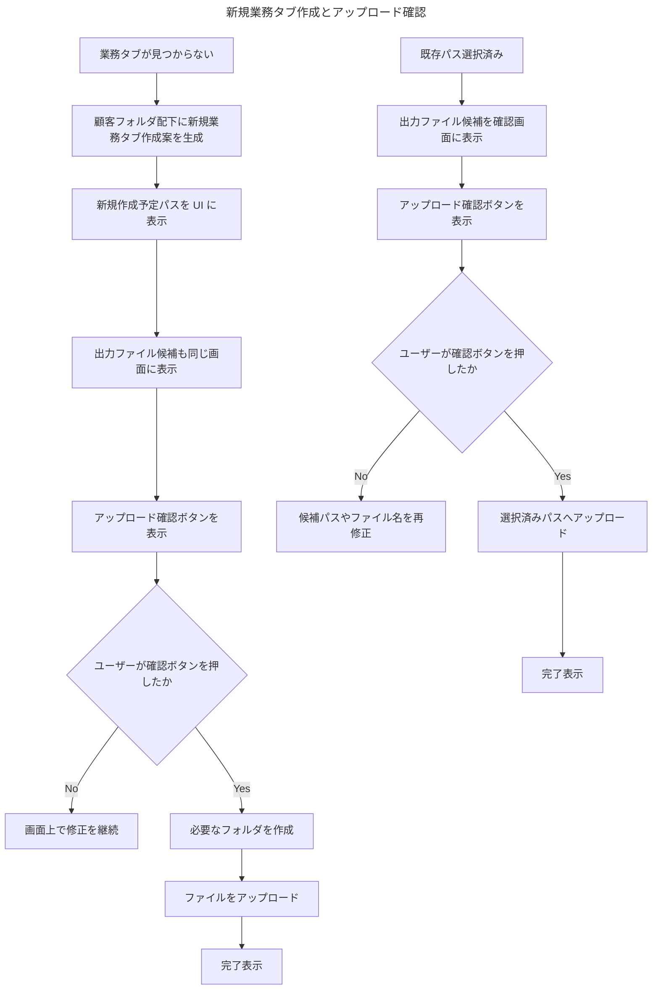

# 2026-04-16 BFS保存先解決 詳細Mermaid

このメモは、2026-04-16 時点で採用した `案A: タブフォルダ探索 + 候補パス提示` を、ユーザーが指定した順序に合わせて整理し直した詳細版のフロー図である。

この版の主眼は以下。

- 業務タブ選択からアップロードまでを一直線の業務フローとして示す
- OCR 後に `顧客名 / 契約ID / 書類種別` を取得し、出力ファイル候補を生成する
- 顧客名の読み方を UI に出し、ユーザーに選択させる
- その後に顧客名候補を UI に出し、ここで顧客名を確定させる
- 確定した顧客名配下だけを backend が BFS 探索する
- 選択した業務タブが存在するかどうかで明確に分岐する
- 既存の業務タブがある場合は、その配下の配置候補パスをすべて UI に出してユーザーに選択させる
- 既存の業務タブがない場合は、顧客フォルダ配下に業務タブを新規作成する案を提示する
- `アップロード確認ボタン` を押した後にのみアップロードする

---

## 1. OCR業務フロー 全体

---

## 2. 顧客名読み方選択と顧客確定 UI フロー

---

## 3. 顧客配下BFSと業務タブ分岐

---

## 4. 既存業務タブ配下の配置先選択フロー

---

## 5. 新規業務タブ作成とアップロード確認

---

## 6. 実装メモ

- フロー順序は `業務タブ選択 -> 命名規則読込 -> ファイルアップロード -> OCR -> 顧客名/契約ID/書類種別取得 -> 出力ファイル候補生成 -> 読み方選択 -> 顧客確定 -> 顧客配下BFS -> 業務タブ分岐 -> アップロード確認 -> アップロード` とする
- 顧客名の読み方は UI で候補表示し、ユーザー選択を必須にする
- 顧客名も UI で候補表示し、その場で確定させる
- BFS の探索開始点は `確定した顧客名フォルダ` に限定する
- 業務タブが既に存在する場合は、その配下の配置候補パスをすべて UI に出す
- 業務タブが存在しない場合は、顧客フォルダ配下への新規作成案を UI に出す
- どちらの分岐でも `アップロード確認ボタン` を押すまでは保存しない