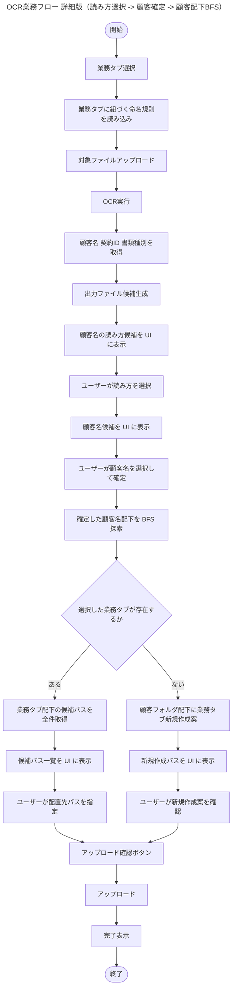
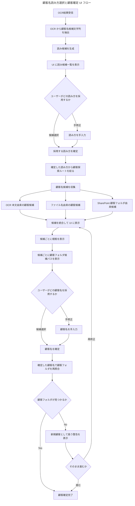
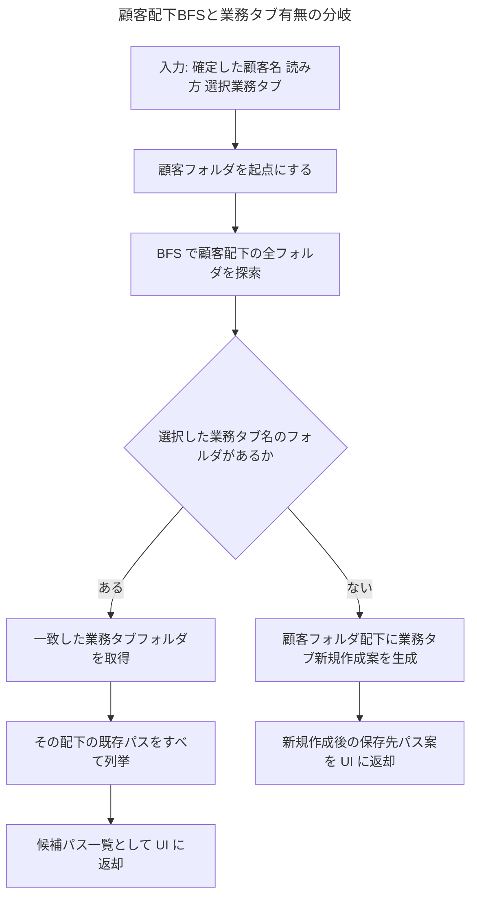
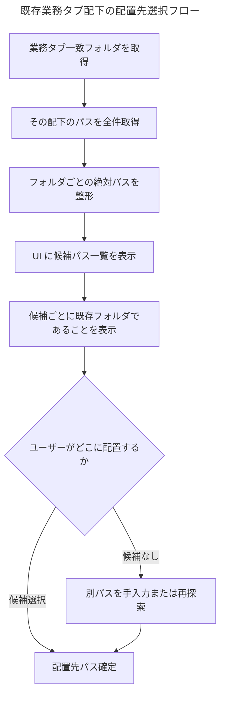
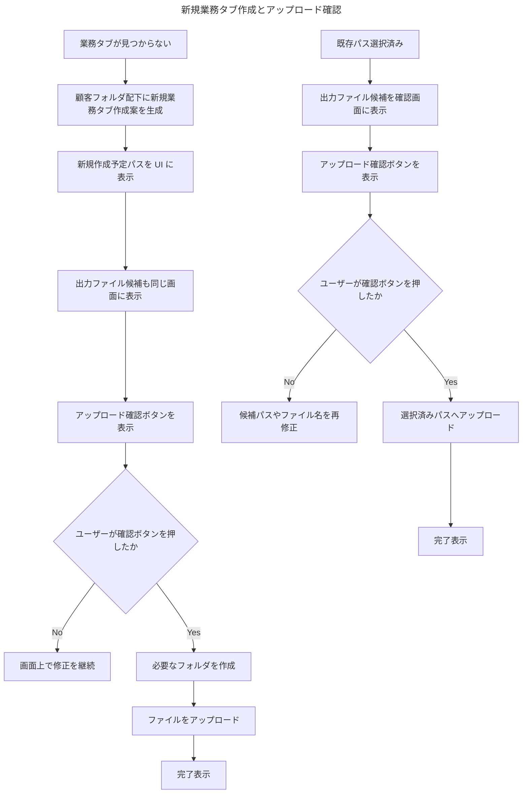

# OCR業務フロー

## 前提条件・業務ルール

### 業務タブによる大分類

- 最初の業務タブ選択で、処理対象となる業務大分類を確定する
- 選択した業務タブに応じて、適用する命名規則と探索対象の業務タブ名が決まる
- 顧客名確定後は、その顧客フォルダ配下だけを探索対象に限定する

### ファイル命名規則

- 命名規則は業務タブごとにダッシュボードで管理する
- OCR 実行後に `顧客名 / 契約ID / 書類種別` を取得し、その結果をもとに出力ファイル候補を生成する
- 最終的な保存ファイル名は、命名規則に沿った候補を確認画面で人が確認したうえで使用する

### 複数ファイル入力のルール

- 一度の操作で扱うファイル群は一社分のみを前提とする
- OCR は一括実行し、同一顧客の書類群としてまとめて解釈する
- 顧客名の読み方と顧客名そのものは、OCR だけで確定せず UI 上で人が確定する

### 保存先解決の考え方

- OCR は保存先を自動確定しない
- 顧客名の読み方を UI に表示し、ユーザーが選択する
- その読み方をもとに顧客候補を UI に表示し、ユーザーが顧客名を確定する
- 確定した顧客名配下を backend が BFS 探索する
- 選択業務タブが存在する場合はその配下の候補パスを UI に出す
- 選択業務タブが存在しない場合は顧客フォルダ配下への新規作成案を UI に出す
- アップロード確認ボタンが押されるまでは保存しない

---

## 1. OCR業務フロー 全体

この図は、今回採用した業務フロー全体を示す。ポイントは、OCR のあとにすぐ保存先を決めるのではなく、まず `読み方の確定` と `顧客名の確定` を UI で行い、その後に顧客配下だけを BFS 探索する点である。また、業務タブが既に存在する場合と、存在しない場合で後段の処理を明確に分けている。

---

## 2. 顧客名読み方選択と顧客確定 UI フロー

この図は、OCR から得た顧客候補をそのまま使わず、`読み方` と `顧客名` を分けて UI で確定する流れを示す。先に読み方を確定することで、顧客候補検索の対象を絞り込みやすくし、その上で OCR 本文由来・ファイル名由来・SharePoint 上の顧客フォルダ由来の候補を統合して人が決める構成にしている。

---

## 3. 顧客配下BFSと業務タブ分岐

この図は、顧客名確定後の backend 側の探索責務を示す。探索起点は確定した顧客フォルダだけに絞り、そこから BFS で配下を見ていく。重要なのは、選択した業務タブが顧客配下に既にあるかどうかで、既存パス提示と新規作成案提示を分けている点である。

---

## 4. 既存業務タブ配下の配置先選択フロー

この図は、顧客配下に業務タブが既に存在していた場合の配置先決定フローである。業務タブ配下の既存パスをすべて UI に提示し、その中から人が配置先を選ぶ。必要なら別パスを手入力したり、再探索に戻したりできるようにして、誤保存を防ぐ設計にしている。

---

## 5. 新規業務タブ作成とアップロード確認

この図は、顧客配下に選択業務タブが存在しなかった場合と、既存パス選択後の最終確認をまとめている。どちらの場合も `アップロード確認ボタン` を押すまでは保存せず、必要なフォルダ作成やアップロードは確認後にだけ実行する。

---

## 実装メモ

- フロー順序は `業務タブ選択 -> 命名規則読込 -> ファイルアップロード -> OCR -> 顧客名/契約ID/書類種別取得 -> 出力ファイル候補生成 -> 読み方選択 -> 顧客確定 -> 顧客配下BFS -> 業務タブ分岐 -> アップロード確認 -> アップロード` とする
- 顧客名の読み方は UI で候補表示し、ユーザー選択を必須にする
- 顧客名も UI で候補表示し、その場で確定させる
- BFS の探索開始点は `確定した顧客名フォルダ` に限定する
- 業務タブが既に存在する場合は、その配下の配置候補パスをすべて UI に出す
- 業務タブが存在しない場合は、顧客フォルダ配下への新規作成案を UI に出す
- どちらの分岐でも `アップロード確認ボタン` を押すまでは保存しない