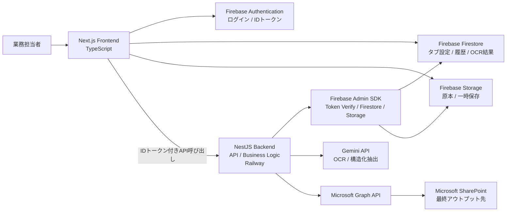
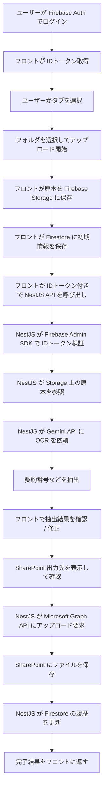
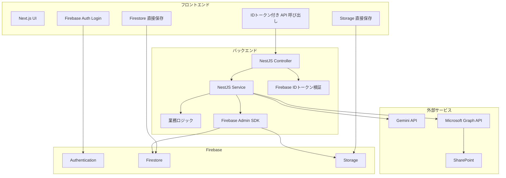
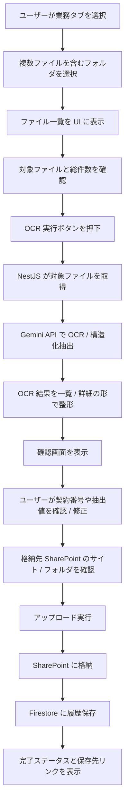
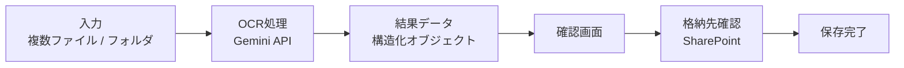
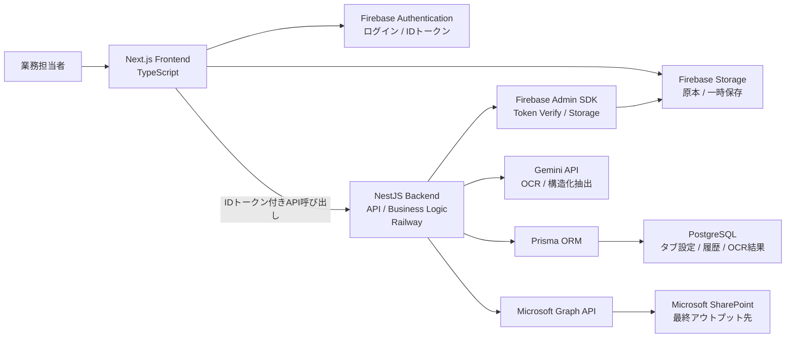
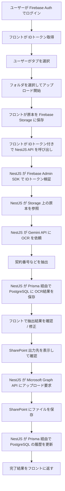
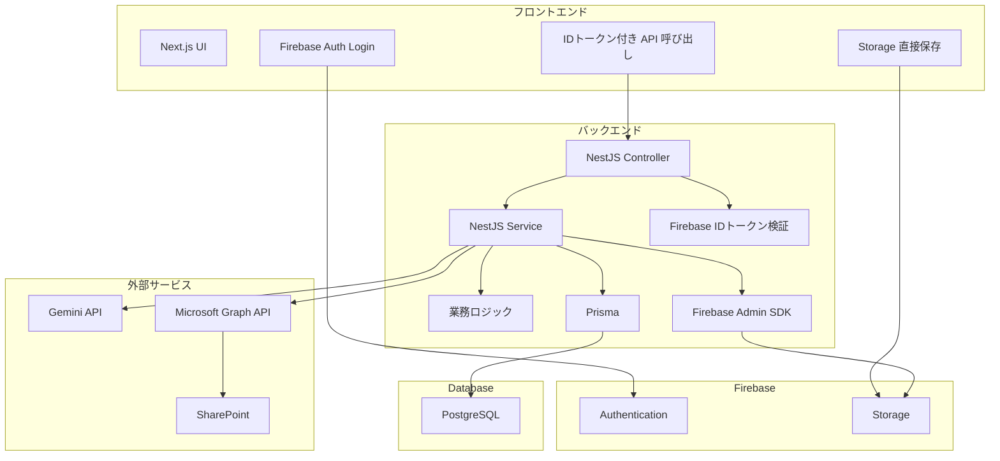

# ROAD OCR Hub 要件定義

## 1. 文書の目的

本書は、現在フロントエンドのみ存在している ROAD OCR Hub に対して、NestJS を API と業務ロジックの中心に据え、Firebase をデータ保存基盤として利用する構成で、実運用可能なシステム要件を定義するための文書である。

前提は以下のとおりとする。

- フロントエンドは TypeScript ベースの Next.js を継続利用する
- API と業務ロジックは NestJS で実装する
- ホスティングは Railway を利用する
- 認証は Firebase Authentication を利用する
- データベース相当は Firebase Firestore を利用する
- ファイル一時保管は Firebase Storage を利用する
- OCR は Gemini API を利用する
- OCR 後の最終アウトプット先は Microsoft SharePoint とする
- SharePoint 連携は Microsoft Graph API 経由で行う
- フロントエンドは認証後、必要な範囲で Firebase に直接アクセスする

## 2. バックエンドとは何か

今回の文脈でいうバックエンドは、単に API のことだけを指すわけではない。

バックエンドは、フロントエンドの裏側で動く以下の責務全体を指す。

- API 提供
- 業務ルールの実行
- データ保存
- 外部サービス連携
- 秘密情報の保護
- ログや履歴の記録
- エラー制御と再試行

API はその一部であり、バックエンドへの入口である。

## 3. 今回のバックエンドの役割

今回のシステムにおいて、NestJS バックエンドはゲートウェイ的な役割を持つが、それだけではない。

### 3.1 ゲートウェイとしての役割

- フロントエンドからのリクエストを受ける
- Gemini API を安全に呼び出す
- Microsoft Graph API を安全に呼び出す
- Firebase への読み書きをフロントに代わって制御する
- 外部 API のレスポンスをフロント向けに整形する

### 3.2 業務ロジックとしての役割

- タブごとの OCR プロンプトを切り替える
- 契約番号抽出結果を検証する
- SharePoint 出力先を決定する
- アップロード単位の状態遷移を管理する
- 実行履歴を保存する

### 3.3 セキュリティ境界としての役割

- Gemini API キーをフロントエンドに露出させない
- Microsoft Graph API の資格情報をフロントエンドに露出させない
- Firestore と Storage への更新をアプリケーションルールに沿って制御する
- Firebase Authentication の ID トークンを NestJS 側で検証する
- フロントから任意の SharePoint パスへ直接書き込ませない

## 4. 今回のアーキテクチャ方針

今回の構成は、NestJS と Firebase を役割分担して併用する。

- NestJS: API、業務ロジック、外部連携、認証トークン検証、状態制御
- Firebase Authentication: ログイン、ユーザー識別、ID トークン発行
- Firestore: タブ設定、履歴、OCR 結果などの業務データ保存
- Firebase Storage: 原本ファイル、一時ファイル、再試行用ファイルの保管

この構成では、認証と基本データ保存は Firebase を活用し、NestJS が業務ロジックと外部連携の中核を担う。

## 5. Prisma に関する整理

今回の方針では Firebase の DB として Firestore を使うため、Prisma は基本的にこのプロジェクトの主たるデータアクセス手段にはならない。

理由は単純で、Prisma は Firestore を主要対象として扱う構成ではないためである。

したがって、この案件での現実的な実装は以下になる。

- NestJS から Firebase Admin SDK を使って Firestore と Storage を操作する
- Prisma の練習は別案件、または PostgreSQL を使う構成で行う

もし Prisma の実践練習もこの案件で行いたいなら、DB を Firestore ではなく PostgreSQL に切り替える必要がある。

つまり、今回の選択肢は以下の 2 つである。

- Firebase DB を優先する: NestJS + Firebase Admin SDK
- Prisma 練習を優先する: NestJS + PostgreSQL + Prisma

今回の要望では Firebase を DB と Storage に使う前提なので、本要件定義では NestJS + Firebase Admin SDK を採用する。

## 6. 背景

現状のアプリケーションは、OCR 業務向けのアップロード UI とダッシュボードのフロントエンドが先行実装されている。

今後は以下を実現する必要がある。

- 業務種別ごとのタブ切り替え
- フォルダ単位のアップロード
- 契約番号の OCR 抽出と人手確認
- アップロード履歴の保存
- SharePoint へのファイル出力
- タブ設定の永続化
- 将来的なタブ追加と設定変更への対応
- NestJS と Firebase を組み合わせたバックエンド構成の確立
- Firebase Authentication を含む認証設計の確立

## 7. システムのゴール

本システムのゴールは、業務担当者が書類フォルダを選択し、対象業務のタブを明示的に指定したうえで、契約番号確認を経て安全にアップロードできるようにすることである。

また、将来的な運用拡張に備え、タブ定義、OCR 指示、後続ワークフロー指示、SharePoint 出力先設定を変更可能な状態にする。

## 8. スコープ

### 8.1 今回の対象

- 5 つの初期タブを持つアップロードフロー
- フォルダ単位アップロード
- Gemini API による契約番号抽出
- 契約番号の確認・修正 UI
- SharePoint 出力先候補の確認 UI
- Firebase Authentication によるログイン
- タブ設定の永続化
- アップロード履歴の永続化
- NestJS API の構築
- Firebase Authentication の導入
- Firestore を用いた業務データ管理
- Firebase Storage を用いた一時ファイル管理
- NestJS からの Microsoft Graph API 連携

### 8.2 今回の対象外

- 本格的な認証・認可
- 権限管理
- OCR 精度改善のための継続学習基盤
- 外部基幹システムとの自動連携
- 本番向け監査ログの完全整備
- 大量並列処理向けの本格ジョブ基盤の導入

## 9. 利用者像

想定利用者は、OCR 対象書類を日次で扱う業務担当者である。

利用者に期待する操作は以下である。

- 対象の業務タブを選ぶ
- 指定フォルダを選択する
- Gemini API が抽出した契約番号を確認する
- 必要に応じて契約番号を修正する
- 出力先を確認して実行する

## 10. 業務フロー要件

基本フローは以下とする。

1. ユーザーが Firebase Authentication でログインする
2. フロントエンドが Firebase ID トークンを取得する
3. ユーザーが業務タブを選択する
4. ユーザーがフォルダを一括アップロードする
5. フロントエンドが原本ファイルを Firebase Storage に保存する
6. フロントエンドが Firestore に初期アップロード情報を保存する
7. フロントエンドが Firebase ID トークン付きで NestJS API に OCR / 出力要求を送る
8. NestJS が Firebase Admin SDK で ID トークンを検証する
9. NestJS が対象ファイルを参照し、Gemini API に OCR を依頼する
10. システムが契約番号などの主要情報を抽出する
11. ユーザーが抽出結果を確認し、必要があれば修正する
12. システムが SharePoint 出力先候補を表示する
13. ユーザーが最終確認してアップロードを実行する
14. NestJS が Microsoft Graph API 経由で SharePoint にファイルを出力する
15. NestJS が Firestore の履歴と状態を更新する

## 11. 機能要件

### 11.1 タブ管理

- 初期状態では以下 5 タブを提供する
  - コラボ
  - モバイル
  - リース・現金
  - 電力
  - 酒井（領収書）
- タブは今後追加できること
- タブごとに以下を保持できること
  - 表示名
  - 表示順
  - OCR 用プロンプトテンプレート
  - 後続ワークフロー用プロンプトテンプレート
  - SharePoint 出力先設定
  - 有効 / 無効状態
- デフォルトタブは削除不可とし、将来的には非表示化を許容する

### 11.2 フォルダアップロード

- フォルダ単位でアップロードできること
- フロントエンドはブラウザでフォルダ選択できること
- フォルダ内ファイル一覧をアップロード前に確認できること
- 対象拡張子の制限を設けられること
- ファイル数・総容量の制限を設けられること

### 11.3 OCR 実行

- OCR エンジンは Gemini API を利用すること
- タブごとの OCR 用プロンプトテンプレートを適用できること
- 契約番号、顧客名、申込番号など主要項目を抽出対象にできること
- OCR 結果は構造化データとして扱えること
- OCR エラー時は手動入力へフォールバックできること

### 11.4 契約番号確認

- OCR で抽出した契約番号を UI 上で確認できること
- ユーザーが契約番号を修正できること
- 確認済みであることを明示的に確定できること

### 11.5 アップロード実行

- 確認済み契約番号をキーにアップロード処理を実行できること
- アップロード対象ごとの進捗を表示できること
- 成功・失敗を利用者に返せること
- SharePoint の保存先パスを記録できること
- Microsoft Graph API を介して対象サイト、ドキュメントライブラリ、フォルダへ出力できること
- タブごとに SharePoint 出力先設定を保持できること

### 11.6 履歴管理

- アップロード履歴を保存できること
- 履歴には少なくとも以下を含むこと
  - タブ名
  - 契約番号
  - フォルダ名
  - ファイル一覧
  - 実行日時
  - ステータス
  - OCR 結果
  - SharePoint の出力結果

### 11.7 管理・設定

- タブの追加・編集ができること
- OCR プロンプトを編集できること
- ワークフロープロンプトを編集できること
- SharePoint の出力先設定を管理できること

### 11.8 SharePoint 連携

- Microsoft Graph API 経由で SharePoint へアップロードできること
- タブごとに以下の出力先設定を保持できること
  - siteId またはサイト識別情報
  - driveId またはドキュメントライブラリ識別情報
  - 出力先フォルダパス
- 出力に成功した場合、SharePoint 上の保存先 URL または参照情報を履歴に残せること
- 連携失敗時はリトライ可能な状態を履歴に残せること

### 11.9 認証

- Firebase Authentication でログインできること
- フロントエンドはログイン後に Firebase ID トークンを取得できること
- NestJS API は受信した Firebase ID トークンを Firebase Admin SDK で検証できること
- Firestore と Firebase Storage は Security Rules により認証済みユーザーのみ操作できること
- ユーザーごとに参照・更新可能なデータ範囲を制御できること

## 12. 非機能要件

### 12.1 開発効率

- フロントエンドとバックエンドを TypeScript で統一し、認知負荷を下げること
- NestJS を使った API / 業務ロジック設計を実践できること
- Firebase をデータ基盤として利用し、初期構築コストを抑えること
- Firebase Authentication を用いて認証実装の負担を下げること

### 12.2 保守性

- 業務ルールをタブ設定として分離できること
- OCR 処理と SharePoint 出力を NestJS のサービス層として分離できること
- Firestore のドキュメント設計を追跡しやすいこと

### 12.3 可用性

- 単一障害時にも原因特定しやすい構成であること
- 少人数でも運用可能なシンプルなインフラであること

### 12.4 セキュリティ

- Gemini API キーはフロントエンドに露出させないこと
- Microsoft Graph API の資格情報はフロントエンドに露出させないこと
- Firebase Admin SDK は NestJS サーバー側だけで利用すること
- Firestore と Firebase Storage のアクセス制御は Security Rules で行うこと
- NestJS API は Firebase ID トークン検証を前提に保護すること
- フロントから任意の SharePoint パスへ直接書き込ませないこと

### 12.5 拡張性

- タブ数が増えても UI とデータ構造が破綻しないこと
- 将来認証を追加しやすいこと
- 将来ジョブキューや非同期化を追加しやすいこと
- 将来の別 OCR サービス差し替えに耐えられること

## 13. 技術選定の結論

今回の要件に対する推奨構成は以下とする。

- フロントエンド: Next.js + TypeScript
- API / 業務ロジック: NestJS
- ホスティング: Railway
- 認証: Firebase Authentication
- 業務データ: Firestore
- 一時ファイル保管: Firebase Storage
- Firebase 連携: Firebase Admin SDK
- OCR / 生成 AI: Gemini API
- 最終出力先: Microsoft SharePoint
- 外部連携 API: Microsoft Graph API

## 14. この構成を推奨する理由

### 14.1 NestJS

- 他業務でも使う技術スタックに合わせられる
- Controller、Service、Module の分離を実践できる
- API と業務ロジックを明確に分離できる
- 将来認証やジョブ追加にも拡張しやすい

### 14.2 Firebase Firestore

- タブ設定、アップロード履歴、OCR 結果などの保存先として扱いやすい
- 初期開発では高速に回しやすい
- Firebase Admin SDK 経由で NestJS から安全に操作できる

### 14.3 Firebase Authentication

- ログイン機能を短時間で導入しやすい
- フロントエンドから直接扱いやすい
- ID トークンを NestJS 側で検証する構成にしやすい
- Firestore / Storage の Security Rules と自然に組み合わせられる

### 14.4 Firebase Storage

- フォルダアップロード由来のファイルを一時保管しやすい
- OCR 前の原本や、SharePoint 出力失敗時の再試行用退避先として使いやすい
- Firestore と組み合わせて参照管理しやすい

### 14.5 Microsoft SharePoint + Microsoft Graph API

- 今回の最終成果物の保存先が SharePoint で明確に決まっている
- Graph API を使うことでサイト、ライブラリ、フォルダ単位で制御しやすい
- 既存の Microsoft 365 運用に自然に乗せやすい

### 14.6 Gemini API

- OCR と構造化抽出を同時に扱いやすい
- タブごとのプロンプト差し替えと相性が良い
- 単純 OCR だけでなく、文書解釈まで同じ API に寄せられる

## 15. 推奨アーキテクチャ

### 15.1 構成概要

1. Next.js フロントエンドが Firebase Authentication でユーザーを認証する
2. フロントエンドが Firestore と Firebase Storage に認証済みで直接アクセスする
3. フロントエンドが Firebase ID トークン付きで NestJS API に要求を送る
4. NestJS が Firebase Admin SDK でトークンを検証する
5. NestJS が Gemini API に OCR 抽出を依頼する
6. NestJS が抽出結果を整形し、契約番号候補をフロントに返す
7. ユーザー確認後、NestJS が Microsoft Graph API 経由で SharePoint にファイルを出力する
8. NestJS が Firestore の履歴と状態を更新する

### 15.2 データ責務の分離

- Firestore
  - ユーザー別の操作履歴
  - タブ設定
  - アップロード履歴
  - OCR 抽出結果
  - SharePoint 出力先メタデータ
- Firebase Storage
  - 原本ファイル
  - 一時保管ファイル
  - 再試行用ファイル
- Microsoft SharePoint
  - 最終出力ファイル
  - 業務運用で参照する成果物
- Gemini API
  - 文書理解と主要項目抽出

### 15.3 NestJS の責務

- API 提供
- Firebase ID トークン検証
- Gemini API の認証と実行
- Microsoft Graph API の認証とアップロード実行
- Firebase Admin SDK 経由での Firestore / Storage 操作
- 入力バリデーション
- エラー時の再試行判断

## 16. バックエンド要件

### 16.1 API 要件

必要な最小セットは以下とする。

- タブ一覧取得 API
- 認証済みユーザー情報取得 API
- タブ追加 API
- タブ更新 API
- タブ無効化 API
- OCR 実行 API
- SharePoint 出力実行 API
- アップロード履歴取得 API
- SharePoint 出力先検証 API

### 16.2 ドメイン要件

最低限必要なドメインモデルは以下とする。

- Tab
- UploadJob
- UploadFile
- OcrExtractionResult
- SharePointDestination

### 16.3 保存要件

- 契約番号は検索可能であること
- タブごとの履歴集計ができること
- エラー時の再確認に必要な情報が残ること
- SharePoint 出力先の追跡情報が残ること

## 17. 初期データモデル案

### 17.1 tabs

- id
- name
- order
- isDefault
- isActive
- icon
- ocrPromptTemplate
- workflowPromptTemplate
- sharepointSiteId
- sharepointDriveId
- sharepointFolderPath
- createdAt
- updatedAt

### 17.2 uploads

- id
- tabId
- folderName
- contractNumber
- status
- sharepointDestinationPath
- sharepointItemId
- sharepointWebUrl
- ocrRawResponse
- ocrStructuredResult
- createdAt
- updatedAt

### 17.3 uploadFiles

- id
- uploadId
- originalFileName
- mimeType
- sizeBytes
- storagePath
- createdAt

## 18. 環境要件

- Railway に NestJS アプリをデプロイできること
- Firebase プロジェクトを作成できること
- Firebase Authentication を利用できること
- Firestore を利用できること
- Firebase Storage を利用できること
- NestJS から Firebase Admin SDK を利用できること
- 環境変数で Gemini API キーと Microsoft Graph API 資格情報を管理できること
- 本番・開発で設定値を分離できること

## 19. 技術選定をするときの考え方

技術選定では、流行や慣れだけで決めず、以下の順序で考えるのがよい。

### 19.1 先に要件を固定する

- 何を作るか
- 誰が使うか
- どのくらいの速度で作る必要があるか
- どこまで拡張する見込みか

### 19.2 役割分担を明確にする

- API と業務ロジックはどこで持つか
- 認証はどこで持つか
- データ保存はどこで持つか
- ファイル保存はどこで持つか
- 外部 API 連携はどこで持つか

NestJS と Firebase を併用する場合は、主役と補助を先に決めることが重要である。

### 19.3 学習目的と本番目的を分けて考える

- 練習したい技術は何か
- 今回のプロジェクトで本当に必要な技術は何か

今回のケースでは、NestJS の理解を深めたいという目的があるため、API と業務ロジックを NestJS に寄せる判断は妥当である。一方で、Firebase DB を選ぶ以上、Prisma を無理に混ぜないほうが設計は素直になる。

### 19.4 セキュリティ境界を確認する

- API キーをどこに置くか
- 外部サービス資格情報をどこで扱うか
- クライアントに直接持たせてよい情報か

### 19.5 将来の変更コストを見る

- OCR ベンダーを差し替えられるか
- 保存先を変更できるか
- 非同期処理を後から足せるか
- 認証や権限管理を追加しやすいか

## 20. 今回の技術選定方針

- フロントエンドは Next.js + TypeScript を継続する
- API と業務ロジックは NestJS に寄せる
- 認証は Firebase Authentication に寄せる
- Firestore を業務データ保存先にする
- Firebase Storage を一時ファイル置き場にする
- Firebase はデータ基盤として利用する
- OCR は Gemini API を利用する
- 最終成果物は SharePoint に出力する
- SharePoint 連携は Microsoft Graph API を利用する
- Prisma はこの案件の主構成には採用しない

## 21. 今後の設計フェーズで詰めるべき事項

- 契約番号の抽出対象項目の確定
- 対象ファイル形式とサイズ上限の確定
- SharePoint のサイト、ライブラリ、フォルダ設計の確定
- OCR 実行対象ファイルの選び方
- 履歴一覧の検索条件
- 本番時の認証方式
- 失敗時の再実行要件
- 一時保存ファイルの保持期間

## 22. Microsoft Graph API 利用時の補足

- SharePoint 出力には Azure AD アプリ登録が必要になる
- 認証方式はアプリ権限を基本とし、必要権限を最小化する
- 候補権限は Files.ReadWrite.All や Sites.ReadWrite.All だが、実運用では対象範囲を絞って検証する
- 大容量ファイル時は Graph のアップロードセッション利用を検討する
- 障害時は Graph API のレスポンスコードを履歴に残し、再実行判断ができるようにする

## 23. Firebase Authentication 利用時の補足

- フロントエンドは Firebase SDK でログイン処理を行う
- Firestore と Storage の直接アクセスは Security Rules で制限する
- NestJS への API 呼び出しでは Authorization ヘッダーに Firebase ID トークンを付与する
- NestJS は Firebase Admin SDK でトークンを検証し、uid をアプリケーションのユーザー識別子として扱う
- 管理者向け操作は custom claims または Firestore 上の権限情報で制御する

## 24. 結論

このシステムでは、認証は Firebase Authentication、データ保存は Firestore と Firebase Storage、API と業務ロジックは NestJS、外部連携は Gemini API と Microsoft Graph API という役割分担にする構成が最も現実的である。

この方針なら、認証と基本データ操作は Firebase の強みを活かしつつ、NestJS の理解も深められる。一方で、Prisma は Firestore と素直に組み合わないため、この案件では無理に採用しないのが妥当である。

## 25. 構成図と処理フロー図

### 25.1 システム構成図



### 25.2 アップロード処理フロー図



### 25.3 認証と責務の分担図



### 25.4 OCR UI フロー図



### 25.5 OCR 結果の表示イメージ



### 25.6 確認画面で表示する項目

- 選択中のタブ名
- 対象フォルダ名
- 読み取ったファイル一覧
- OCR 対象として使ったファイル
- 契約番号
- 顧客名
- 申込番号や帳票番号
- 抽出できた主要項目の一覧
- OCR の信頼度または要確認ステータス
- 手動修正欄
- SharePoint の保存先サイト
- ドキュメントライブラリ名
- 保存先フォルダパス
- 実行ボタン
- 完了後の保存先リンク

## 26. PostgreSQL + Prisma に変更した場合の可視化

このセクションは、現在の Firebase Firestore + Firebase Storage 案を、PostgreSQL + Prisma 中心の構成へ切り替えた場合にどう見えるかを比較用に整理したものである。

前提は以下とする。

- 認証は引き続き Firebase Authentication を利用する
- API と業務ロジックは NestJS を継続利用する
- 業務データは Firestore ではなく PostgreSQL に保存する
- ORM / スキーマ管理は Prisma を利用する
- ファイル保存は比較のため Firebase Storage を維持する
- OCR は Gemini API、最終出力は SharePoint を継続利用する

### 26.1 システム構成図



### 26.2 アップロード処理フロー図



### 26.3 責務分担図



### 26.4 Firebase 案との主な違い

- Firestore への直接保存がなくなり、業務データは NestJS 経由で PostgreSQL に集約される
- Prisma が入ることで、テーブル定義、型、安全なクエリ、マイグレーション管理が可能になる
- フロントが直接扱う Firebase サービスは主に Authentication と Storage になる
- 検索、集計、履歴管理、将来の管理画面は PostgreSQL 案の方が伸ばしやすい

### 26.5 この構成にした時の見え方

- Firebase 案:
  認証とデータ保存の一部をフロントから直接扱い、初速を優先する構成
- PostgreSQL + Prisma 案:
  認証は Firebase のまま活かしつつ、業務データは NestJS 経由で SQL に集約し、将来の検索・集計・整合性を重視する構成

---

## 27. OCR 業務フロー詳細ルール

### 27.1 業務タブ大分類

OCR 処理は業務カテゴリ（タブ）ごとに管理される。初期タブは以下の通り。

| 順序 | タブ名 | アイコン | 説明 |
|------|--------|----------|------|
| 0 | コラボ | users | コラボレーション案件 |
| 1 | モバイル | smartphone | モバイル関連案件 |
| 2 | リース・現金 | banknote | リース・現金案件 |
| 3 | 電力 | zap | 電力関連案件 |
| 4 | 酒井（領収書） | receipt | 酒井担当の領収書案件 |

- タブはダッシュボード（マネジメント向け画面）から追加・編集・並び替えが可能
- 各タブには以下の設定を持つ:
  - OCR プロンプト（Gemini に送るプロンプトテンプレート）
  - ワークフロープロンプト（後続処理の指示テンプレート）
  - SharePoint 接続設定（サイト URL、ドライブ ID、フォルダパス）

### 27.2 ファイル命名規則

OCR 処理後、ファイルは以下の命名規則でリネームされる。命名ルールは業務カテゴリ（タブ）ごとに異なり、ダッシュボードで管理される。

#### 基本形式

```
[業務カテゴリ]_[クライアント名]_[契約番号 or 識別子]_[連番].[拡張子]
```

#### 例

- `コラボ_ABC商事_C2025-001_01.pdf`
- `モバイル_XYZ通信_M2025-042_01.pdf`
- `電力_関東電力_E2025-100_01.pdf`

#### 命名ルール管理

- 命名パターンはタブ設定の一部としてダッシュボードから設定可能
- OCR 結果から自動的に抽出された項目（クライアント名、契約番号など）を命名に使用
- 手動での上書きも可能

### 27.3 一社ルール（複数ファイル = 1 クライアント）

同一クライアントに関する複数のファイルは「一社」として束ねて処理する。

- アップロード時点でユーザーが複数ファイルを選択した場合、それらは 1 つのアップロードバッチとして扱う
- OCR 実行後、同一クライアント（Name 一致 or 契約番号プレフィックス一致）のファイルは自動でグループ化
- グループ化されたファイルは SharePoint アップロード時に同一フォルダへ格納
- ユーザーはアップロード一覧でグループの確認・手動の紐付け変更が可能

### 27.4 OCR 一括処理方針

OCR はファイル単位ではなく、コンテキストリミット内で一括処理する。

#### 処理フロー

1. ユーザーがファイルをキューに追加（複数ファイル対応）
2. 「OCR を実行する」ボタンで一括実行開始
3. キュー内のファイルをコンテキストリミット（トークン上限）を考慮してバッチに分割
4. バッチごとに Gemini API へ送信し、OCR 結果を取得
5. 結果を個別ファイルに紐付けて保存

#### コンテキストリミット管理

- Gemini API のトークン上限を考慮し、1 回の API コールに含めるファイル数を自動調整
- 大きなファイル（高解像度画像、多ページ PDF）は単独バッチとして処理
- バッチ分割ロジックはバックエンド（NestJS）側で制御

#### エラーハンドリング

- バッチ内の一部ファイルが失敗しても、他のファイルの結果は保持
- 失敗ファイルはステータス「エラー」として表示し、個別リトライ可能

### 27.5 格納先フォルダ構造

SharePoint への格納先は以下の階層で構成される。

```
[業務大分類]/[クライアント名]/[契約ID]/
├── original/          ← 元ファイル（PDF/画像）
├── ocr_result/        ← OCR 抽出結果（JSON/テキスト）
└── renamed/           ← リネーム済みファイル
```

#### 例

```
コラボ/ABC商事/C2025-001/
├── original/
│   ├── scan_001.pdf
│   └── scan_002.pdf
├── ocr_result/
│   ├── scan_001_result.json
│   └── scan_002_result.json
└── renamed/
    ├── コラボ_ABC商事_C2025-001_01.pdf
    └── コラボ_ABC商事_C2025-001_02.pdf
```

#### フォルダ自動作成

- SharePoint アップロード時にフォルダが存在しない場合は自動作成
- Graph API の `PUT` でパスを指定することで、中間フォルダも含めて一括作成可能